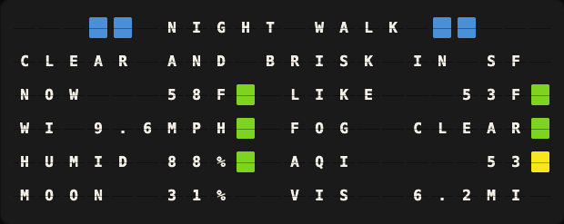
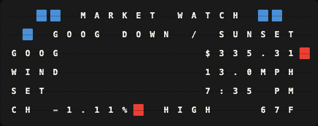
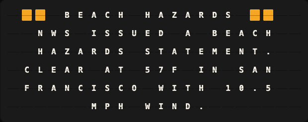
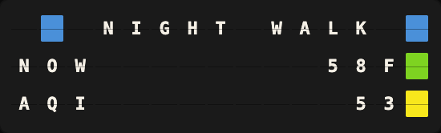

# Generative Dashboard Plugin

An AI editor for your split-flap board: it reads every variable your other plugins expose and composes the board a person would want to glance at right now.



**→ [Setup Guide](./docs/SETUP.md)**

## Overview

Point it at any OpenAI-compatible model and it curates your board the way an
editor writes for a reader: it knows who is watching (you tell it once), what
time it is in your timezone, what has been happening (it keeps its own
journal), what the rest of your rotation already covers, and what every
number means. It chooses the form — a grid of stats or a sentence — lays the
board out, and only re-composes when something material changes.

**This plugin rewards tuning.** Output quality depends on four things you
control: what you tell it about your household, which plugins you have
enabled, when you want to see what, and which model you point it at. Expect
to spend a little time on each — the difference between an untuned and a
tuned board is the difference between a printout and a page.

Numbers on the board are never typed by the model. In grid form it places
variables and the plugin substitutes live values every render; in sentence
form it writes `{plugin.var}` placeholders that stay live the same way.
Formulas (`{= IF(air.aqi > 100, "red", "green") }`) are compiled and
test-run against real values before the board accepts them.

### What it composes

Every board below is real output, captured live and rendered through
core's board preview:

| | |
|---|---|
|  |  |
| *Auto mode chose a **ledger grid**: GOOG's slide framed in the title, red lights on the moving numbers.* | *Auto mode chose **prose**: one story worth a sentence, headline framed in warning orange.* |



*The same plugin on a 15×3 Note — it composes for whatever board size
renders it.*

## Template Variables

### Display

| Variable | Description |
|---|---|
| `generative_dashboard.rows.{n}.text` | The composed board, one entry per row |
| `generative_dashboard.prose` | The generated sentence (template form), in prose/auto mode |
| `generative_dashboard.headline` | The single most important stat right now |

### Metadata

| Variable | Description |
|---|---|
| `generative_dashboard.reason` | Why the board last changed, in the model's words |
| `generative_dashboard.stat_count` | Tiles currently placed |
| `generative_dashboard.degraded` | Empty when healthy; `no_llm`, `no_data`, `awaiting_board`, `unconfigured` otherwise |
| `generative_dashboard.generated_at` | When the composition was last generated (local time) |
| `generative_dashboard.model` | Model that composed the board |

## Example Templates

The plugin renders whole boards itself (`get_formatted_display`), so the
usual page is simply:

```
{{generative_dashboard.rows.0.text}}
{{generative_dashboard.rows.1.text}}
{{generative_dashboard.rows.2.text}}
{{generative_dashboard.rows.3.text}}
{{generative_dashboard.rows.4.text}}
{{generative_dashboard.rows.5.text}}
```

Or borrow just the headline for a corner of another page:

```
{{generative_dashboard.headline}}
```

## Configuration

| Setting | Default | Description |
|---|---|---|
| `audience` | — | **The highest-leverage setting.** Who watches this board and what they care about, as a paragraph |
| `api_base_url` | OpenAI | Any OpenAI-compatible chat completions endpoint |
| `api_key` | — | Required (any value for local endpoints that skip auth) |
| `model` | `gpt-4o-mini` | See model notes in the setup guide |
| `output_mode` | `auto` | `auto` lets the AI pick grid or prose per moment |
| `temperature` | `0.3` | Low on purpose — this is layout, not art |
| `refresh_seconds` | `900` | Re-layout floor; values stay live regardless |
| `default_threshold_pct` | `5` | How far a number must move to earn a re-layout |
| `use_color` | `true` | Status lights, banded by the model's own range rules |
| `watchlist` | empty | Empty sends everything; set only to restrict |
| `pinned` / `notes` / `thresholds` | — | Per-variable fine tuning |
| `extra_instructions` | — | Appended to the system prompt |

## Features

- **Auto form choice** — grid when several stats deserve a glance, prose when one story needs a sentence, sticky so the board never flaps
- **Live values in a stable layout** — the model places variables, never numbers; figures tick every render, layout holds for `refresh_seconds`
- **Range-driven status lights** — the model encodes what an AQI of 160 means once; the light flips live as values cross thresholds
- **Full formula language** — core's 50 template functions, compiled and test-run before the board accepts them
- **An editor's context** — audience brief, local clock, self-written journal, rotation awareness, grouped variable catalog
- **Visible reasoning** — every composition records the model's thinking to a local log for later study
- **Truthful by construction** — a number the model was not given cannot reach the board
- **Resume on restart** — the board picks up its last composition instead of resetting

## Author

FiestaBoard Team
